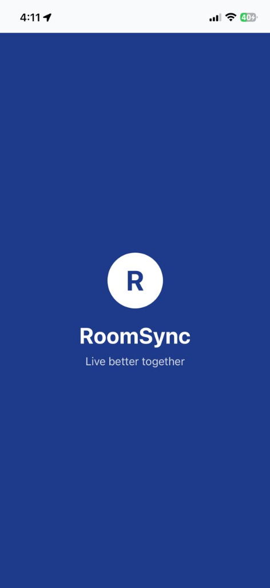
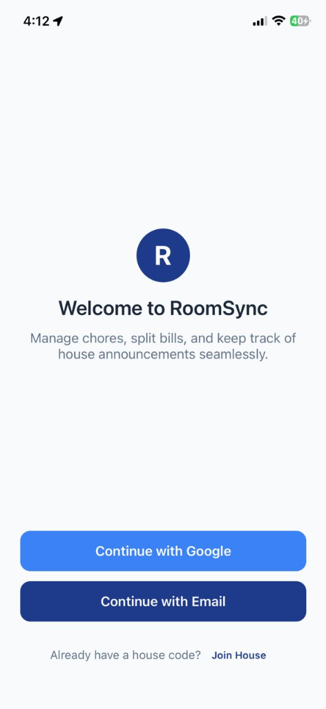
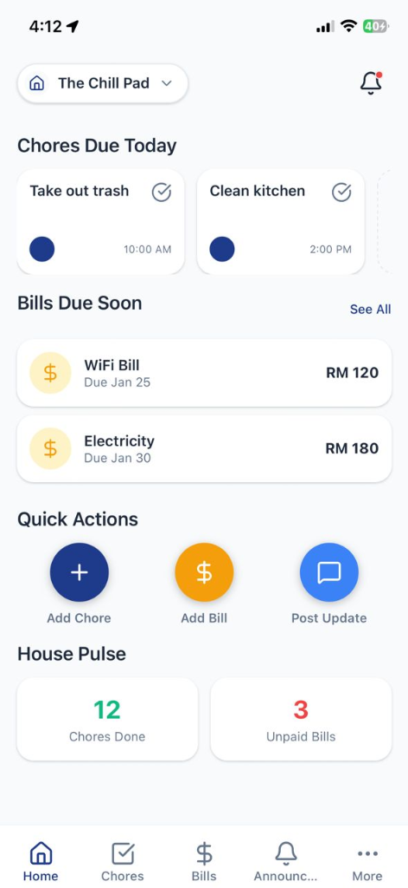
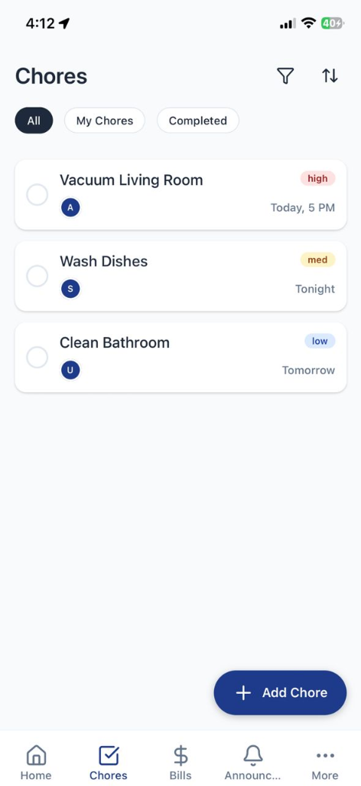
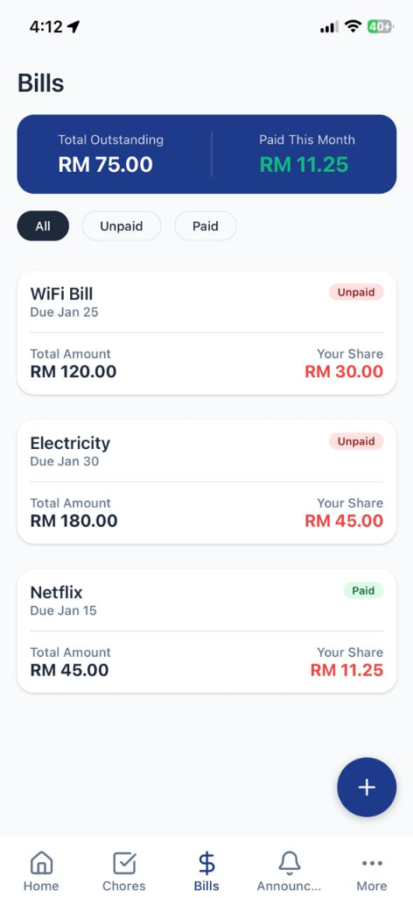
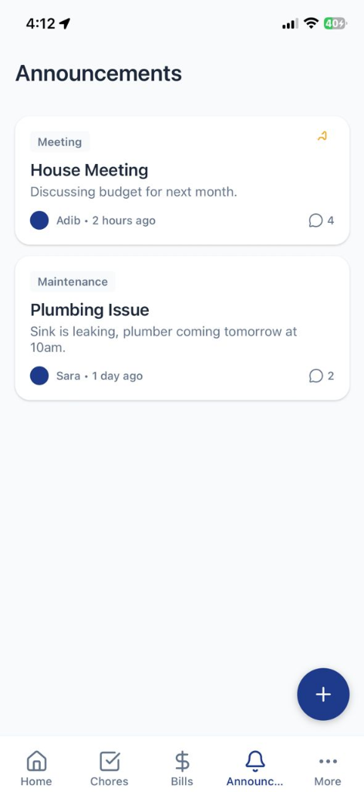
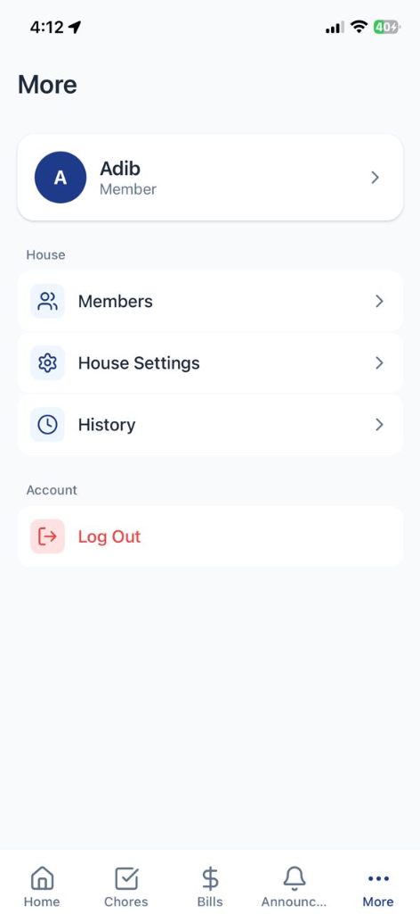

# RoomSync

RoomSync is a React Native application built with Expo for managing shared living spaces, including chore tracking, bill splitting, and house announcements.

> [!NOTE]
> **Status: Development**
> This project is currently in active development.

## Screenshots

### Onboarding
| Spash Screen | Welcome |
|:---:|:---:|
|  |  |

### App Interface
| Home Dashboard | Chores List | Bills Overview |
|:---:|:---:|:---:|
|  |  |  |

### Communication & Settings
| Announcement Feed | More Menu |
|:---:|:---:|
|  |  |

## Features
- **House Management**: create or join houses via invite codes.
- **Chore Tracking**: Assign chores, set due dates, and track completion.
- **Bill Splitting**: Split bills equally or by custom amounts and track payments.
- **Announcements**: Post house updates with pinning and comments.
- **Member Profiles**: View housemates and their activity history.

## Getting Started

### Prerequisites
- Node.js
- npm or yarn

### Installation

```bash
npm install
```

## Running the App

### Mobile (iOS/Android)

Start the Metro Bundler:
```bash
npx expo start
```
- Press `a` to open on Android Emulator/Device
- Press `i` to open on iOS Simulator (Mac only)
- Scan QR code with **Expo Go** app to run on physical device

## Project Structure
- `src/screens/`: Application screens (Auth, Home, Chores, Bills, etc.)
- `src/components/`: Reusable UI components (Buttons, Cards, Inputs)
- `src/navigation/`: Navigation configuration (Tab & Stack navigators)
- `src/context/`: Global state management (AuthContext)
- `src/theme/`: Design system tokens (Colors, Typography, Layout)
